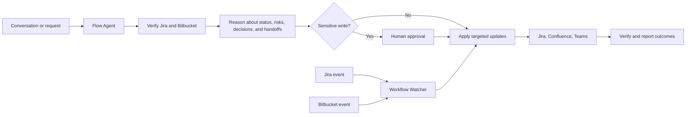

# FlowSync AI Hackathon Submission

## Project

**FlowSync AI** — an agentic engineering workflow assistant that keeps work
moving by synchronizing updates across tickets, code, meetings, documentation,
and team communication.

**Agent:** Flow Agent (`@flow-agent`)

## Problem Definition

Engineering context is scattered across Jira tickets, Bitbucket pull requests,
Teams conversations, meeting transcripts, and Confluence pages. Developers,
engineering leads, QA partners, product owners, release managers, and scrum
masters repeatedly reconstruct the same information:

- What changed?
- What is blocked or stale?
- Which PRs need review?
- What is ready for QA?
- What was decided, and who owns the next action?
- Which project, release, or sprint update must be published?

The manual translation between tools creates stale status, missed handoffs,
lost decisions, and unnecessary coordination work.

## Solution

FlowSync AI provides one engineering coordination layer over the tools teams
already use. It turns live system signals and unstructured conversation into:

- verified workflow status and change summaries
- blockers, dependencies, and delivery risks
- review and QA handoffs
- decisions and owned action items
- ticket-specific Jira comments
- Confluence project, sprint, feature, or release pages
- Teams engineering briefs

Sprint ceremonies are supported, but the platform is deliberately broader than
a standup bot or sprint tracker.

## Prototype

### Interactive — Flow Agent

The custom agent at `.github/agents/flow-agent.agent.md` uses LLM reasoning as
the orchestrator. Users speak naturally:

- "`@flow-agent sync RDSB-14913`"
- "`@flow-agent summarize today's standup`"
- "`@flow-agent update project status`"
- "`@flow-agent check blockers and QA handoffs`"
- "`@flow-agent prepare a release update for Teams`"

Flow Agent extracts engineering entities and commitments, verifies Jira and
Bitbucket, correlates signals, previews system-specific updates, applies
authorized writes, and reports the result of each action.

### Background — Workflow Watcher

`watcher/daemon.mjs` detects workflow changes without a conversation:

```bash
node watcher/daemon.mjs
node watcher/daemon.mjs --once
node watcher/daemon.mjs --dry-run --once
node watcher/daemon.mjs --status
```

The watcher:

- detects Jira status changes in a configurable JQL scope
- detects Bitbucket PR state changes when a repository is configured
- stages events in Confluence
- posts ticket-specific Jira comments for significant signals
- persists snapshots and prevents duplicate instances

The optional `jiraJql` configuration allows project, sprint, release, component,
or other Jira-defined monitoring scopes.

## Commands

| Command | What it does |
| --- | --- |
| `/flowsync-sync` | Synchronize engineering context across tools |
| `/flowsync-status` | Show live delivery status and attention queues |
| `/flowsync-transcript` | Convert a transcript into verified workflow actions |
| `/flowsync-update` | Process a quick ticket, PR, QA, blocker, or release event |
| `/flowsync-page` | Create or refresh a Confluence workflow page |
| `/flowsync-watch` | Operate the background watcher |
| `/flowsync-brief` | Generate and optionally deliver an engineering brief |

## Agentic Workflow With Human Control



Safety controls:

- live sources are fetched before status claims or writes
- facts, inferences, and unknowns remain distinct
- Jira transitions require explicit approval
- the first interactive Confluence write requires confirmation
- Jira comments contain only ticket-relevant context
- a merged PR is treated as a handoff signal, not proof of completion
- multi-system mutations are previewed
- the watcher supports dry-run and single-instance locking

## Demonstrated Capability

The prototype has:

1. fetched live Jira ticket state
2. analyzed a meeting transcript using LLM reasoning
3. posted ticket-specific Jira comments
4. updated a live Confluence status page
5. detected a Jira status transition through the watcher
6. generated a Teams-ready engineering brief

## AI Usage

- GitHub Copilot supported iterative design and implementation of the custom
  agent, workflow prompts, watcher, and documentation.
- Flow Agent uses the LLM as its reasoning and orchestration layer for
  unstructured requests and multi-system coordination.
- The watcher combines deterministic change detection with optional AI
  synthesis for concise engineering briefs.

## Build Log

1. Explored CLI, application, and agent-first approaches.
2. Built the Copilot agent intent layer and integration prompts.
3. Connected live Jira, Bitbucket, and Confluence skill scripts.
4. Demonstrated transcript analysis and ticket-specific updates.
5. Added the persistent background watcher and Teams brief generation.
6. Fixed Jira status change detection to preserve raw status names.
7. Expanded the product from SprintSync to FlowSync AI: broadened the scope,
   introduced Flow Agent, added configurable Jira JQL, and aligned all agent,
   runtime, and product specifications.

## Value Hypothesis

Expected outcomes:

- less time spent compiling and distributing engineering status
- earlier blocker and dependency visibility
- faster code-review and QA handoffs
- fewer decisions and action owners lost in meetings
- fresher project, release, and sprint documentation
- traceable automation without surrendering control of sensitive actions

Proposed measures:

- time saved per team per week on coordination updates
- blocker and action-item capture rate
- age of review and QA queues
- status-page freshness
- update acceptance rate without human correction
- traceability of attempted and completed actions

## Feasibility

Prototype dependencies:

- Jira API and installed Jira Copilot skill
- Bitbucket API and installed Bitbucket Copilot skill
- Confluence API and installed Confluence Copilot skill
- VS Code Copilot Chat custom agents
- optional Teams webhook and GitHub Models access for brief delivery/synthesis

Primary risks and mitigations:

- **Ambiguous ticket-to-PR links:** preserve uncertainty and verify explicit IDs.
- **Conflicting meeting and system status:** report the conflict; do not overwrite
  live truth.
- **Credential leakage:** use local ignored configuration and environment
  variables.
- **Incorrect external updates:** preview multi-system writes and require
  approval for transitions.
- **Watcher availability:** support one-shot execution, dry-run, and launchd or
  cron scheduling.

## Pilot Path

1. Start with one engineering team and Flow Agent for read-only status.
2. Enable approved Jira comments and Confluence updates.
3. Run the watcher in dry-run mode, then enable routine event writes.
4. Configure the team's preferred project, sprint, or release JQL scope.
5. Add Teams brief delivery.
6. Measure time saved, correction rate, missed blockers, and handoff latency.
